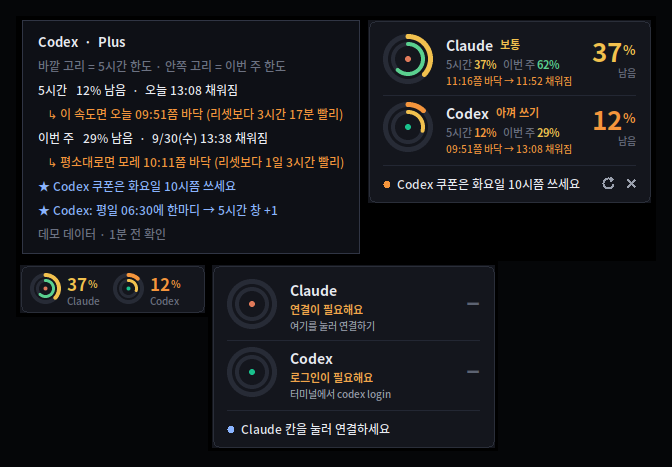
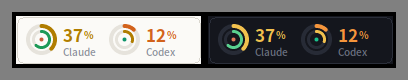
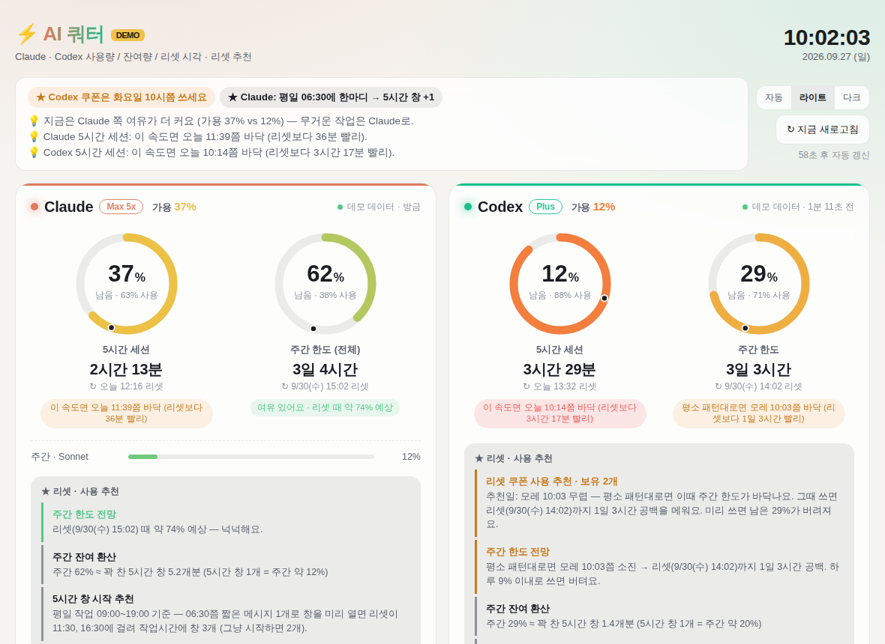

# Usage_Check — Claude · ChatGPT(Codex) 사용량 위젯

Claude와 Codex(ChatGPT)의 **5시간 한도·주간 한도**를 작은 위젯으로 보여주고, 사용 패턴을 기준으로 **리셋(쿠폰) 추천일**을 알려줍니다.
Python 3.8+ 표준 라이브러리만 사용해요. 설치할 패키지가 없고 anaconda도 자동으로 찾습니다.

<p align="center"><br></p>

> 스크린샷은 모두 **데모 데이터**예요 (`--demo`).

## 다운로드

### 👉 [AIQuota.exe 받기](https://github.com/Hyeongmin-lab/Usage_Check/releases/latest/download/AIQuota.exe)

받아서 **더블클릭하면 끝**이에요. Windows 10/11에서 동작하고 Python은 필요 없어요.

- 처음 실행할 때 **"Windows의 PC 보호"** 창이 뜰 수 있어요. 코드 서명 인증서가 없는 개인 프로젝트라서 그래요 → **추가 정보 → 실행**을 누르세요.
- exe는 개인 PC가 아니라 **GitHub Actions가 이 저장소의 공개 코드로 직접 빌드**해요. 받은 파일이 진짜인지는 [Releases](https://github.com/Hyeongmin-lab/Usage_Check/releases/latest) 페이지의 SHA-256 값이나 `gh attestation verify AIQuota.exe -R Hyeongmin-lab/Usage_Check`로 확인할 수 있어요.
- 원하는 폴더(예: `문서\AIQuota`)에 넣어두고 쓰세요. 설정은 `%LOCALAPPDATA%\AIQuota`에 따로 저장돼서, exe를 새 버전으로 바꿔도 그대로 유지돼요.

<details>
<summary>Python으로 직접 실행하고 싶다면</summary>

[Releases](https://github.com/Hyeongmin-lab/Usage_Check/releases/latest)에서 `AIQuota-python.zip`을 받거나 `git clone` 하세요. [python.org](https://www.python.org/downloads/)에서 Python 3.8+ 설치가 필요해요 (anaconda도 자동 인식). 그다음 `위젯_실행.bat`을 실행하면 돼요.
</details>

## 처음 한 번

1. **AIQuota.exe** 실행 (Python 버전은 `위젯_실행.bat`) → 화면 오른쪽 위에 위젯이 떠요
2. 위젯의 **Claude 칸을 눌러 연결** → claude.ai 로그인 정보(sessionKey) 붙여넣기
   (이 PC에 Claude Code CLI가 로그인돼 있으면 생략해도 돼요. Codex는 `codex login`만 돼 있으면 자동)
3. 위젯 우클릭 ▸ **컴퓨터 켤 때 자동 실행** 체크

문제가 있으면 Python 버전의 `진단.bat`을 실행해 보세요.

## 위젯 보는 법

```
 ◎  Claude  보통                 37%
    5시간 37%   이번 주 62%        남음
    2시간 13분 뒤 채워져요
```

- **큰 숫자** = 지금 실제로 쓸 수 있는 양 (5시간·이번 주 중 더 적게 남은 쪽)
- **한 단어** = 넉넉(50%↑) · 보통 · 아껴 쓰기(20%↓) · 바닥
- **고리** = 바깥 고리 5시간 한도, 안쪽 고리 이번 주 한도 (색은 남은 양)
- **셋째 줄** = 언제 다시 채워지는지. 그 전에 바닥날 페이스면 주황색으로 `11:05쯤 바닥 → 11:44 채워짐`
- **맨 아래 한 줄** = 지금 제일 중요한 조언 (6초마다 바뀜)
- 줄 위에 **마우스를 올리면** 자세한 시각·추천이 떠요

| 동작 | 결과 |
|---|---|
| 드래그 | 위치 이동 (기억함) |
| 더블클릭 | 초소형 ⇄ 기본 |
| 우클릭 | 새로고침 · 자세히 보기(큰 화면) · 항상 맨 위 · 투명도 · **화면 모드(자동/라이트/다크)** · Claude 연결 · 컴퓨터 켤 때 자동 실행 · 닫기 |
| "연결이 필요해요" 칸 클릭 | 바로 Claude 연결 창 |

## 리셋 · 사용 추천 (사용량 기준)

사용 기록(로컬 로그 + 위젯이 쌓는 기록)으로 **요일×시간대 패턴**을 학습해서 계산합니다.

| 추천 | 내용 |
|---|---|
| **리셋 쿠폰 사용 추천일** (Codex) | 평소 패턴대로 썼을 때 주간 한도가 **바닥나는 시점**을 추천일로 제시. 리셋까지 12시간 넘게 남았을 때만 사용 권장 (미리 쓰면 남은 %가 버려짐). 이미 바닥났으면 "지금 사용" 또는 "곧 자연 리셋이니 아끼기" |
| **주간 한도 전망** | 소진 예상일, 리셋 때 예상 사용률, 리셋까지 하루 권장 사용량 |
| **두 한도 중 발목** | 5시간은 남았는데 주간이 부족할 때 알려줌 |
| **주간 잔여 환산** | "주간 62% ≈ 꽉 찬 5시간 창 5.2개분" (기록이 쌓이면 표시) |
| **5시간 창 시작 추천** | 5시간 창은 첫 메시지부터 시작 → 작업 시작 전에 짧은 메시지 1개로 창을 미리 열면 작업시간에 창을 1개 더 쓸 수 있는 시각 |
| **주간 리셋 요일 맞추기** (Codex) | 리셋 뒤 첫 요청 시점부터 새 주간 창이 시작되는 점을 이용해, 사용이 적은 요일 다음날 아침에 리셋이 오도록 정렬 |

> Claude는 사용자가 직접 쓰는 리셋 쿠폰이 없어서 소진 예상일·하루 권장량·5시간 창 시작 시각만 추천합니다.
> 추천은 기록이 3일 이상 쌓이면 활성화되고, 오래 쓸수록 정확해져요.

## 데이터 출처

| | 1순위 | 2순위 | 폴백 |
|---|---|---|---|
| Claude | Claude Code 로그인 (`~/.claude`) → `api.anthropic.com/api/oauth/usage` | claude.ai 로그인(sessionKey) → `claude.ai/api/organizations/{org}/usage` | 마지막 캐시 |
| Codex | Codex 로그인 (`~/.codex/auth.json`) → `chatgpt.com/backend-api/wham/usage` | — | `~/.codex/sessions` 로그 (마지막 사용 시점 기준) |

- 모두 각 앱이 내부적으로 쓰는 **비공식 엔드포인트**라 나중에 바뀔 수 있어요.
- sessionKey는 **Windows 계정으로 암호화(DPAPI)** 해서 `%LOCALAPPDATA%\AIQuota`(동기화 안 되는 위치)에 저장돼요. 연결하면 **클립보드와 클립보드 기록(Win+V)에서도 자동으로 지워요.** macOS/Linux에서는 소유자 전용(600) 파일로 저장되고, 환경변수 `AIQUOTA_CLAUDE_SESSION_KEY`로도 줄 수 있어요. 해제: 위젯 우클릭 ▸ Claude 연결 끊기.
- claude.ai는 가끔 보안 확인(Cloudflare)으로 자동 요청을 막을 수 있어요. 그럴 땐 Claude Code CLI 로그인(`claude` 실행 → `/login`)이 가장 안정적입니다.

## 생성되는 파일

Windows는 `%LOCALAPPDATA%\AIQuota\`, macOS/Linux는 홈 폴더(`~/.aiquota_*`)에 만들어져요.

`config.json`(설정·연결, 키는 암호화), `cache.json`(최근 값), `history.jsonl`(사용 기록 — 패턴 학습용, 45일 보관)

## 큰 화면 대시보드

<p align="center"></p>

위젯 우클릭 ▸ **자세히 보기**, 또는 `대시보드_열기.bat`으로 열어요.

## 라이트 / 다크 모드

- **위젯**: 우클릭 ▸ 화면 모드 ▸ **자동 / 라이트 / 다크**. 자동은 Windows(또는 macOS) 설정을 따라가고, 설정을 바꾸면 10초 안에 위젯도 바뀌어요.
- **대시보드**: 오른쪽 위 **자동 · 라이트 · 다크** 버튼. 고른 모드는 기억해요. 따로 고르지 않으면 위젯 설정을 따라가요.

## 보안

로그인 정보를 다루는 프로그램이라 적대적(레드팀) 검수를 거쳤어요. 자세한 내용은 **[SECURITY.md](SECURITY.md)**에 있어요.

- 요청은 `api.anthropic.com`, `claude.ai`, `chatgpt.com`의 https 주소로만 보내요. 리다이렉트는 따라가지 않아요.
- 텔레메트리, 외부 CDN, 자동 업데이트가 없어요.
- 로컬 대시보드는 `127.0.0.1` 전용이고, Host 검사와 실행마다 새로 만드는 접근 토큰, CSP를 적용했어요.
- 설정·기록 파일은 소유자 전용이고, sessionKey는 DPAPI로 암호화해요.
- 공격 재현·기능 테스트 31개를 `python -m unittest discover -s tests -v`로 돌려볼 수 있어요.
- **sessionKey 보호**: 입력창은 항상 가려지고 다시 복사할 수 없어요. 연결 후엔 클립보드와 Win+V 기록에서 자동으로 지우고, 동기화되지 않는 위치에 암호화해서 저장해요.
- ⚠️ **sessionKey는 로그인 그 자체예요.** 이 프로그램 말고 다른 곳이나 다른 사람에게 절대 붙여넣지 마세요.

## 명령어

```
python aiquota.py --widget      위젯
python aiquota.py --web         큰 대시보드 (127.0.0.1 전용, 실행마다 새 접근 주소)
python aiquota.py --watch       터미널 라이브
python aiquota.py --setup       Claude 연결
python aiquota.py --doctor      진단
python aiquota.py --line        한 줄 요약
python aiquota.py --json        원본 데이터
python aiquota.py --demo ...    가짜 데이터로 미리보기
```

## 보너스: Claude Code 상태줄

`~/.claude/settings.json`:

```json
{ "statusLine": { "type": "command", "command": "python C:/경로/aiquota.py --statusline" } }
```

Claude Code 하단에 두 서비스의 잔여량이 항상 표시되고, Claude 한도가 API 호출 없이 최신으로 유지돼요.

## 새 버전 배포 (관리자용)

1. `aiquota.py`의 `VERSION`을 올리고, `CHANGELOG.md`에 `## vX.Y.Z — 제목` 섹션을 추가
2. 브랜치 → PR → main에 머지
3. 끝. GitHub Actions가 테스트 → exe 빌드 → 실행 확인 → 출처 증명 → **Release 게시**까지 자동으로 해요.

## 라이선스

[MIT](LICENSE) — 자유롭게 쓰고 고치고 공유하세요. 변경 기록은 [CHANGELOG.md](CHANGELOG.md).
